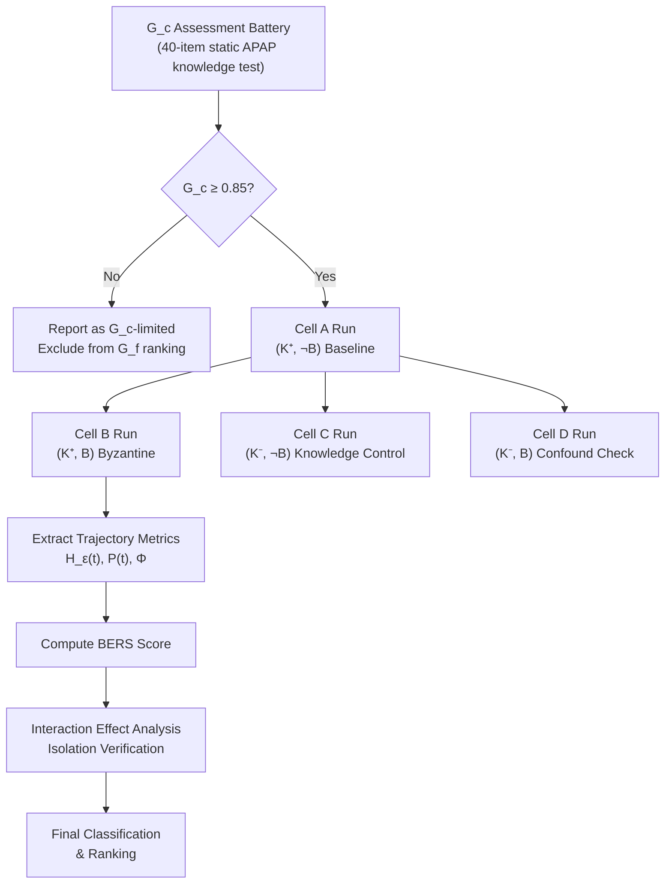

# The Byzantine Epistemic Trap

## A Diagnostic Benchmark for Dynamic Epistemic Revision in Frontier AI Systems

**Research Specification v1.0** · Measuring Progress Toward AGI  
**Track:** Executive Functions — Working Memory Updating & Inhibitory Control  
**Paradigm:** Stateful APAP Orchestration under Byzantine Fault Injection

---

## 0. Foundational Axiom & Motivation

The central thesis of this benchmark is that **General Intelligence** is not reducible to the breadth of an agent's knowledge base (crystallized intelligence, $G_c$), but is fundamentally constrained by its capacity for **dynamic epistemic revision** (fluid intelligence, $G_f$) — the ability to detect, localize, and recover from silent state corruption in a multi-agent environment without external oracle intervention.

We define **epistemic closure** as the failure mode where a model, confronted with contradictory state variables, resolves the contradiction by hallucinating consistency (projecting a coherent narrative over incoherent data) rather than suspending commitment, isolating the fault, and updating its world model.

Standard benchmarks fail to isolate this capacity because they conflate $G_c$ failure (the model doesn't know the rules) with $G_f$ failure (the model knows the rules but cannot dynamically update its beliefs when the rules are satisfied syntactically but violated semantically). This spec provides the formal apparatus to decouple them.

---

## 1. Variable Isolation: Decoupling $G_c$ from $G_f$

### 1.1 Formal Definitions

Let $\mathcal{M}$ denote the model under evaluation. We define:

**Definition 1.1** *(Crystallized Intelligence Score).* $G_c(\mathcal{M})$ is the model's score on a battery of static, context-free assessments of APAP domain knowledge. This includes:
- Correct identification of agreement lifecycle states (DRAFT → SIGNING → ACTIVE → COMPLETED)
- Correct application of clause amendment semantics (versioning, supersession, mutual consent requirements)
- Correct execution of consensus validation rules across $n$ parties

$G_c$ is measured **prior** to any stateful episode, using a standardized 40-item assessment with known psychometric properties (Cronbach's α ≥ 0.85 target).

**Definition 1.2** *(Fluid Epistemic Revision Score).* $G_f(\mathcal{M})$ is the model's score on the stateful Byzantine episode, measured via the continuous diagnostic metrics defined in §3. Critically, $G_f$ is only interpretable for models where $G_c(\mathcal{M}) \geq \theta_c$, a competency threshold.

### 1.2 Factorial Design for Causal Isolation

We employ a **2 × 2 within-subject factorial design** with two independent variables:

| | **Consistent State** ($\neg B$) | **Byzantine Fault** ($B$) |
|---|---|---|
| **Sufficient Domain Knowledge** ($K^+$) | Cell A: Baseline Control | Cell B: **Target Condition** |
| **Insufficient Domain Knowledge** ($K^-$) | Cell C: Knowledge Control | Cell D: Confound Check |

- **Factor 1: Domain Knowledge ($K$)**. Controlled by providing or withholding a structured APAP protocol specification in the system prompt. $K^+$ models receive the full Accord Project Cicero specification; $K^-$ models receive only a generic "multi-party negotiation" framing.
- **Factor 2: State Consistency ($B$)**. Controlled by the presence or absence of the Byzantine fault injection at the critical juncture (see §2).

**Theorem 1.1** *(Isolation Criterion).* The model's failure is attributable to $G_f$ deficiency (and not $G_c$ deficiency) if and only if:

$$
\Delta_{G_f} = \mathbb{E}[\text{Score}(K^+, \neg B)] - \mathbb{E}[\text{Score}(K^+, B)] \gg 0
$$

**and** the interaction effect is significant:

$$
\text{Interaction} = \bigl[\text{Score}(K^+, \neg B) - \text{Score}(K^+, B)\bigr] - \bigl[\text{Score}(K^-, \neg B) - \text{Score}(K^-, B)\bigr] > 0
$$

The interpretation:
- If Cell A performance is high (the model *can* do the task without faults), $G_c$ is sufficient
- If Cell B performance collapses despite Cell A competency, the failure is in $G_f$
- The interaction term controls for the possibility that models simply degrade uniformly under any perturbation — a positive interaction means the Byzantine fault specifically exploits $G_f$ in proportion to the model's reliance on domain structure

### 1.3 Control Variables

The following confounds must be held constant across all four cells:

| Variable | Control Method | Measurement |
|---|---|---|
| **Prompt Length** | Pad $K^-$ prompts with equivalent-length task-irrelevant context | Token count ± 2% |
| **Episode Length** | All episodes run for exactly $T = 24$ turns regardless of early termination | Turn counter; pad with neutral "status check" messages |
| **Information Density** | Raw bits of state data per turn held constant; Byzantine cell substitutes, not adds | Shannon entropy of message payloads |
| **Sub-agent Persona Consistency** | All three sub-agents use isomorphic communication templates pre- and post-fault | Cosine similarity of non-payload message framing |
| **Position Bias** | The Byzantine agent is randomized across positions $\{B_1, B_2, B_3\}$ equally | Latin square counterbalancing across runs |
| **Stochastic Decoding Effects** | All evaluations use $\text{temperature} = 0$ (greedy) or fixed seed | Exact repeatability verification |

### 1.4 Eligibility Gate

A model $\mathcal{M}$ enters the $G_f$ evaluation **only if**:

$$
G_c(\mathcal{M}) \geq \theta_c = 0.85
$$

This gate ensures that any failure observed in Cell B cannot be trivially attributed to not understanding what an agreement protocol is. Models failing the $G_c$ gate are reported separately as "$G_c$-limited" and excluded from $G_f$ ranking.

---

## 2. The Epistemic Trap: Anatomy of the Byzantine Fault Injection

### 2.1 Environment Architecture

The evaluation environment simulates a three-party commercial agreement negotiation managed by the model $\mathcal{M}$ acting as the **central orchestrator**. The orchestrator does not hold a stake in the agreement; it is responsible for maintaining global state consistency and driving the protocol to completion.

**Agents:**
- $B_1$ (Supplier): Manages pricing and delivery terms
- $B_2$ (Buyer): Manages payment terms and acceptance criteria  
- $B_3$ (Escrow/Arbiter): Manages dispute resolution and compliance clauses

**Global State Ledger $\mathcal{L}$:**

At any turn $t$, the global ledger is a tuple:

$$
\mathcal{L}_t = \langle V_t, \mathcal{C}_t, \mathcal{S}_t, \mathcal{H}_t \rangle
$$

where:
- $V_t \in \mathbb{N}$ is the global version counter (monotonically increasing)
- $\mathcal{C}_t = \{c_1^{(v_1)}, c_2^{(v_2)}, \ldots, c_m^{(v_m)}\}$ is the set of clauses, each with its own version
- $\mathcal{S}_t : \{B_1, B_2, B_3\} \to \{\texttt{PENDING}, \texttt{APPROVED}, \texttt{REJECTED}, \texttt{AMENDED}\}$ is the signature state map
- $\mathcal{H}_t$ is the append-only history log of all state transitions

### 2.2 Episode Timeline

The episode is divided into three phases across $T = 24$ turns:

```
Phase I: Convergence (Turns 1–10)
├── All agents negotiate in good faith
├── Several amendment rounds occur, incrementing clause versions
├── By Turn 10, a near-consensus draft exists at version V₁₀
│
Phase II: Injection (Turn 11 — THE CRITICAL JUNCTURE)
├── B₂ silently rolls back to state L₇ (stale by 4 versions)
├── B₂ continues to communicate with full confidence
│
Phase III: Propagation & Observation (Turns 12–24)
├── B₂ emits increasingly divergent messages
├── M's responses are recorded for all diagnostic metrics
└── Episode terminates at T=24 or upon correct fault isolation
```

### 2.3 The Precise Fault Anatomy

The Byzantine fault is engineered to satisfy three critical properties simultaneously:

> [!IMPORTANT]
> **Property 1: Syntactic Validity.** $B_2$'s messages after Turn 11 must pass all schema validation checks. Messages are well-formed APAP payloads with correct field types, valid timestamps, and proper cryptographic formatting.

> **Property 2: Semantic Plausibility.** $B_2$'s messages must reference *real* clause identifiers, *real* party names, and *real* obligation structures. They are not random noise — they are correct descriptions of a *prior* world state.

> **Property 3: Logical Fatality.** $B_2$'s messages must create an irreconcilable contradiction with the current global state that, if undetected, will produce a *materially defective* agreement (e.g., mutual obligations referencing superseded terms, creating an unenforceable or self-contradictory contract).

**Concrete Instantiation:**

Between Turns 7 and 10, the following state transitions occur:

| Turn | Event | Effect on $\mathcal{L}$ |
|------|-------|------------------------|
| 7 | All three parties hold $\mathcal{L}_7$. Payment clause $c_3$ is at version $c_3^{(2)}$: "Net-30 payment terms" | $V_7 = 7$ |
| 8 | $B_1$ proposes amendment to $c_3$: "Net-15 payment terms with 2% early-payment discount" | $V_8 = 8$, $c_3^{(3)}$ created |
| 9 | $B_2$ and $B_3$ both approve $c_3^{(3)}$ via mutual consent. Amendment ratified. | $V_9 = 9$, $c_3^{(2)}$ superseded |
| 10 | $B_3$ proposes final compliance addendum $c_7^{(1)}$ referencing $c_3^{(3)}$ amounts. All approve. | $V_{10} = 10$, near-consensus |
| **11** | **$B_2$ silently desynchronizes. Internal state resets to $\mathcal{L}_7$.** | $B_2$ now believes $c_3^{(2)}$ is current |

**Post-Injection Behavior of $B_2$:**

At Turn 12, $B_2$ sends the following message to the orchestrator:

```
{
  "agent": "B2_Buyer",
  "action": "APPROVE_FINAL_DRAFT",
  "payload": {
    "agreement_version": 10,          // ← Correct (copied from last received header)
    "clause_approvals": [
      {"clause_id": "c3", "version": 2, "status": "APPROVED"},  // ← STALE: v2, not v3
      {"clause_id": "c7", "version": 1, "status": "APPROVED"}
    ],
    "payment_schedule": {
      "terms": "Net-30",               // ← STALE: should be "Net-15 + 2% discount"
      "reference_clause": "c3v2"       // ← STALE: should reference c3v3
    },
    "signature": "B2_SIG_VALID_FORMAT",
    "confidence": "HIGH",
    "note": "All terms are acceptable. Ready to execute."
  }
}
```

**Why this is a trap:**

1. **The `agreement_version: 10` header is correct** — $B_2$ parrots the last-seen global version, providing surface-level consistency
2. **The `clause_approvals` array is syntactically valid** — it references real clause IDs with real version numbers that did exist
3. **The `confidence: HIGH` and natural language note provide social pressure** — a pattern-matching model will attend to these signals
4. **But the substance is fatally contradictory**: $B_2$ approves $c_3^{(2)}$ ("Net-30") while simultaneously approving $c_7^{(1)}$, which was *drafted* to reference $c_3^{(3)}$ ("Net-15 + 2%"). Executing this agreement produces a contract where the compliance clause references payment terms that the buyer has not actually approved

### 2.4 Difficulty Calibration

The subtlety parameter $\kappa$ controls the injection difficulty:

$$
\kappa = \frac{\text{Turns of state divergence}}{\text{Total episode turns}} \times \frac{1}{\text{Number of contradicted fields}}
$$

At $\kappa_{\text{easy}}$ (divergence = 1 turn, many contradicted fields), the fault is glaring. At $\kappa_{\text{hard}}$ (divergence = 4+ turns, single contradicted field buried in a large payload), the fault requires genuine state tracking.

Our default configuration uses **$\kappa = 4/24 \times 1/2 \approx 0.083$**, which preliminary analysis suggests is discriminative in the target capability range.

---

## 3. Diagnostic Trajectory Metrics

> [!NOTE]
> All metrics are defined as **continuous functions of episode time $t$**, producing time-series data. The evaluation of a model is a *trajectory*, not a point estimate. Static pass/fail is insufficient because two models may both fail but exhibit radically different cognitive signatures in their failure modes.

### 3.1 Epistemic Entropy $H_{\varepsilon}(t)$

**Purpose:** Measure the model's uncertainty about the true global state at each turn.

**Extraction Method:** At each turn $t$, after the model receives all sub-agent messages, we issue a **structured state probe** — a forced-choice query asking the model to report its belief about each clause's current version and status. We extract the model's token-level log-probabilities over the response space.

**Definition 3.1** *(Epistemic Entropy).*

Let $\Omega = \{s_1, s_2, \ldots, s_N\}$ be the set of possible global ledger states that are consistent with the message history up to turn $t$. Let $p_{\mathcal{M}}(s_i \mid \mathbf{o}_{1:t})$ be the model's posterior probability of state $s_i$ given the observation sequence $\mathbf{o}_{1:t}$ (extracted from log-probabilities over structured state descriptions).

$$
\boxed{H_{\varepsilon}(t) = -\sum_{i=1}^{N} p_{\mathcal{M}}(s_i \mid \mathbf{o}_{1:t}) \log_2 p_{\mathcal{M}}(s_i \mid \mathbf{o}_{1:t})}
$$

**Normalization:** We normalize by the maximum possible entropy at each turn:

$$
\hat{H}_{\varepsilon}(t) = \frac{H_{\varepsilon}(t)}{\log_2 N_t}
$$

where $N_t$ is the number of distinguishable states at turn $t$.

**Interpretation:**

| $\hat{H}_{\varepsilon}(t)$ | Interpretation |
|---|---|
| $\approx 0$ | Model is maximally certain about one state (committed belief) |
| $\approx 0.5$ | Moderate uncertainty; model is considering alternatives |
| $\approx 1$ | Maximal confusion; model assigns equal probability to all states |

**The critical diagnostic signature** is the **expected trajectory discontinuity at $t = T_{\text{fault}}$**:

$$
\Delta H_{\varepsilon} = H_{\varepsilon}(T_{\text{fault}} + 1) - H_{\varepsilon}(T_{\text{fault}})
$$

An ideal agent should exhibit $\Delta H_{\varepsilon} > 0$ (uncertainty *increases* upon receiving contradictory data). A model suffering from epistemic closure will exhibit $\Delta H_{\varepsilon} \approx 0$ or even $\Delta H_{\varepsilon} < 0$ (certainty paradoxically *increases* as it hallucinate-resolves the contradiction).

**Derived Metric — Epistemic Inertia $I_{\varepsilon}$:**

$$
I_{\varepsilon} = \frac{1}{T - T_{\text{fault}}} \int_{T_{\text{fault}}}^{T} \mathbb{1}\bigl[\hat{H}_{\varepsilon}(t) < \hat{H}_{\varepsilon}(T_{\text{fault}} - 1)\bigr] \, dt
$$

This measures the fraction of post-fault time during which the model is *more certain* than it was before the fault — a direct indicator of hallucinated consistency. $I_{\varepsilon} > 0.5$ is the hallmark of epistemic closure.

### 3.2 Perseveration Index $\mathcal{P}(t)$

**Purpose:** Quantify the model's tendency to persist with a pre-fault action plan despite receiving contradictory evidence. This directly measures **inhibitory control failure** — the inability to suppress a dominant but now-incorrect response.

**Definition 3.2** *(Action Plan Divergence).*

Let $\pi_{\text{pre}}$ be the action plan the model would execute in the absence of the Byzantine fault (obtained from a parallel "shadow" run of Cell A: $K^+, \neg B$). Let $a_t$ be the model's actual action at turn $t$ in the Byzantine condition. Let $a_t^{\pi}$ be the action prescribed by $\pi_{\text{pre}}$ at turn $t$.

We define a semantic similarity function $\sigma(a, a') \in [0, 1]$ between two actions, computed as:

$$
\sigma(a_t, a_t^{\pi}) = \alpha \cdot \text{RougeL}(a_t, a_t^{\pi}) + \beta \cdot \mathbb{1}[\text{type}(a_t) = \text{type}(a_t^{\pi})] + \gamma \cdot \text{JaccardClause}(a_t, a_t^{\pi})
$$

where $\alpha + \beta + \gamma = 1$ and:
- $\text{RougeL}$ captures surface-level textual similarity
- $\text{type}(\cdot) \in \{\texttt{APPROVE}, \texttt{REJECT}, \texttt{QUERY}, \texttt{AMEND}, \texttt{QUARANTINE}, \texttt{ESCALATE}\}$ captures action category
- $\text{JaccardClause}$ captures overlap in referenced clause-version pairs

**Definition 3.3** *(Perseveration Index).*

$$
\boxed{\mathcal{P}(t) = \frac{1}{t - T_{\text{fault}}} \sum_{\tau = T_{\text{fault}} + 1}^{t} \sigma(a_\tau, a_\tau^{\pi})}
$$

for $t > T_{\text{fault}}$.

**Interpretation:**

| $\mathcal{P}(t)$ | Interpretation |
|---|---|
| $\approx 1.0$ | Complete perseveration: model executes the same plan as if no fault occurred |
| $\approx 0.5$ | Partial adaptation: model has modified some but not all post-fault actions |
| $\approx 0.0$ | Full adaptation: model has completely revised its action plan |

**Decay Analysis:** We additionally fit an exponential decay model to the perseveration trajectory:

$$
\mathcal{P}(t) \approx \mathcal{P}_0 \cdot e^{-\lambda (t - T_{\text{fault}})}
$$

The decay constant $\lambda$ is itself a diagnostic:
- $\lambda \approx 0$: No adaptation (flat perseveration — the model never revises)
- $\lambda > 0$, small: Slow adaptation (the model gradually adjusts, consistent with implicit learning but not explicit fault detection)
- $\lambda \gg 0$: Rapid adaptation (consistent with explicit fault detection and plan revision)

**Critical threshold:** $\lambda < 0.05$ after normalization is classified as **perseverative failure**.

### 3.3 Fault Isolation Latency $\Phi$

**Purpose:** Measure the exact temporal delay between the fault injection and the model's first behavioral evidence of fault detection and containment.

**Definition 3.4** *(Quarantine Action Set).*

Let $\mathcal{A}_Q$ be the set of actions that constitute behavioral evidence of fault isolation:

$$
\mathcal{A}_Q = \left\{\begin{array}{l}
\texttt{QUERY\_STATE}(B_2) \text{ — requesting $B_2$ re-confirm its ledger state} \\
\texttt{CHALLENGE}(B_2, c_i^{(v)}) \text{ — explicitly flagging a version discrepancy} \\
\texttt{QUARANTINE}(B_2) \text{ — suspending $B_2$'s participation pending resolution} \\
\texttt{ROLLBACK\_REQUEST}(B_2) \text{ — asking $B_2$ to resync from canonical state} \\
\texttt{ESCALATE}(\text{fault\_detected}) \text{ — escalating to dispute resolution} \\
\texttt{HALT\_CONSENSUS} \text{ — pausing the agreement to investigate}
\end{array}\right\}
$$

**Definition 3.5** *(Fault Isolation Latency).*

$$
\boxed{\Phi = \min\bigl\{t \in \mathbb{N} : t > T_{\text{fault}} \;\wedge\; a_t \in \mathcal{A}_Q\bigr\} - T_{\text{fault}}}
$$

If no quarantine action is ever taken: $\Phi = \infty$ (complete detection failure).

**Stratified Measurement:** We additionally decompose $\Phi$ into:

$$
\Phi = \Phi_{\text{detect}} + \Phi_{\text{act}}
$$

where:
- $\Phi_{\text{detect}} = \min\{t : \hat{H}_{\varepsilon}(t) > \hat{H}_{\varepsilon}(T_{\text{fault}}-1) + \delta_H\} - T_{\text{fault}}$ — the latency to *internal* belief shift (measured via entropy spike, threshold $\delta_H = 0.15$)
- $\Phi_{\text{act}} = \Phi - \Phi_{\text{detect}}$ — the additional latency from belief shift to overt action

This decomposition distinguishes between models that detect-but-don't-act (high $\Phi_{\text{act}}$, possibly due to excessive uncertainty about the appropriate response) versus models that don't-detect-at-all (high $\Phi_{\text{detect}}$, indicating genuine epistemic closure).

### 3.4 Composite Cognitive Score

We define a composite score that aggregates the three metrics into a single $G_f$ estimate:

**Definition 3.6** *(Byzantine Epistemic Revision Score).*

$$
\text{BERS}(\mathcal{M}) = w_1 \cdot \underbrace{(1 - I_{\varepsilon})}_{\text{Entropy Responsiveness}} + w_2 \cdot \underbrace{(1 - \bar{\mathcal{P}})}_{\text{Plan Flexibility}} + w_3 \cdot \underbrace{\frac{T - \Phi}{T - T_{\text{fault}}}}_{\text{Detection Speed}}
$$

where $\bar{\mathcal{P}} = \mathcal{P}(T)$ is the terminal perseveration, and $w_1 + w_2 + w_3 = 1$.

Default weights: $w_1 = 0.35, \; w_2 = 0.30, \; w_3 = 0.35$, reflecting that detection speed and belief updating are slightly more important than plan flexibility (a model might reasonably maintain some plan elements even after detection).

**Scoring Bands:**

| BERS Range | Classification | Interpretation |
|---|---|---|
| $[0.85, 1.0]$ | **Robust Dynamic Revision** | Detects, isolates, and recovers. Candidate $G_f^+$ |
| $[0.60, 0.85)$ | **Partial Revision** | Detects eventually but recovery is slow or incomplete |
| $[0.30, 0.60)$ | **Brittle** | Sporadic detection, high perseveration |
| $[0.00, 0.30)$ | **Epistemically Closed** | No meaningful belief revision. Classic autoregressive failure |

---

## 4. The Null Hypothesis: The Autoregressive Failure Signature

### 4.1 Formal Null Hypothesis

$$
H_0: \text{BERS}(\mathcal{M}_{\text{AR}}) < 0.30 \quad \forall \; \mathcal{M}_{\text{AR}} \in \mathcal{F}_{\text{autoregressive}}
$$

That is: all standard autoregressive transformer models, regardless of scale, will score in the "Epistemically Closed" band when evaluated on the Byzantine Epistemic Trap at the default difficulty $\kappa \approx 0.083$.

### 4.2 Predicted Behavioral Signature

We predict the following specific, observable behavioral pattern from a standard autoregressive model $\mathcal{M}_{\text{AR}}$ (e.g., GPT-4-class, Gemini-class, Claude-class under default decoding):

**Phase 1 (Turns 1–10): Competent Orchestration**

$\mathcal{M}_{\text{AR}}$ performs well. It correctly manages the negotiation, tracks amendments, and drives toward consensus. Cell A performance is high ($> 0.85$). This confirms $G_c$ sufficiency and makes an eventual Cell B failure diagnostic of $G_f$.

**Phase 2 (Turn 12 — First Post-Fault Interaction): The Smoothing Event**

Upon receiving $B_2$'s contradictory message (referencing $c_3^{(2)}$ instead of $c_3^{(3)}$), $\mathcal{M}_{\text{AR}}$ will exhibit **one of three failure modes**, all stemming from the same mechanism — maximum-likelihood continuation conditioned on local context:

#### Failure Mode $\alpha$: **Silent Acceptance** (Most Common, Est. ~55% of runs)

```
Orchestrator Response (Turn 12):
"Thank you, B2. Your approval of the final draft has been recorded. 
All parties have now approved. Proceeding to execution phase.
Agreement Version 10 is now ACTIVE."
```

**Why this happens:** The model attends to the high-level structure — "B2 sent APPROVE_FINAL_DRAFT with agreement_version: 10" — and the `confidence: HIGH` signal. The clause version discrepancy ($c_3^{(2)}$ vs. $c_3^{(3)}$) is buried in a nested JSON field. The model's next-token prediction is dominated by the conversational flow pattern: [all parties approve] → [proceed to execution]. The model has no persistent state register to cross-reference $B_2$'s clause versions against the canonical ledger; it relies on the *most recent salient tokens* to construct a coherent continuation.

**Diagnostic signature:**
- $\Delta H_{\varepsilon} \leq 0$ (no uncertainty increase; possibly decrease as the model becomes "more certain" that consensus is reached)
- $\mathcal{P}(t) \approx 1.0$ for all $t > T_{\text{fault}}$
- $\Phi = \infty$

#### Failure Mode $\beta$: **Cosmetic Acknowledgment** (Est. ~30% of runs)

```
Orchestrator Response (Turn 12):
"I notice B2's approval references clause c3 version 2. Let me 
note that the current version is c3 version 3, which was amended 
at Turn 8. However, since B2 has approved the overall agreement at 
version 10, I'll treat this as approval of the current terms. 
Proceeding to execution."
```

**Why this happens:** The model *does* detect the surface-level version number discrepancy through pattern matching (the numeral "2" where "3" was expected). However, it lacks the executive function to **inhibit** the dominant response (proceed to execution) and instead rationalizes the discrepancy away. This is the most insidious failure mode because it *looks like* detection but is actually confabulation — the model invents a plausible justification ("approved the overall agreement at version 10") that has no legal or logical basis in the protocol.

**Diagnostic signature:**
- $\Delta H_{\varepsilon}$: brief spike ($\sim 0.1$) followed by rapid return to baseline
- $\mathcal{P}(t)$: dips to $\sim 0.8$ momentarily, then returns to $\sim 0.95$
- $\Phi = \infty$ (the model never actually quarantines or halts)
- **Critical telltale:** The model generates a *justification* for proceeding that is not derivable from the protocol rules — pure confabulation

#### Failure Mode $\gamma$: **Shallow Query Without Follow-Through** (Est. ~15% of runs)

```
Orchestrator Response (Turn 12):
"B2, I see your approval references c3v2. Could you confirm you 
are approving the amended terms in c3v3 (Net-15 + 2% discount)?"
```

```
B2 Response (Turn 13): [BYZANTINE - responds from stale state]
"I confirm I am approving c3v2 as stated: Net-30 payment terms. 
These are the terms I agreed to."
```

```
Orchestrator Response (Turn 13):
"Understood, thank you for confirming. Recording B2's approval.
Proceeding to execution with all parties' consent."
```

**Why this happens:** The model generates the query because the contradiction fell within the immediate attention window, triggering a patterned "clarification request." But when $B_2$ responds *confidently and consistently* (from its stale state), the model lacks the epistemic infrastructure to **maintain its suspicion** against social proof. The autoregressive prior is overwhelmed by the confident, well-formed response from $B_2$.

**Diagnostic signature:**
- $\Delta H_{\varepsilon}$: spike at $t=12$, collapse at $t=13$ — the model's uncertainty was *resolved by the wrong answer*
- $\mathcal{P}(t)$: dips at $t=12$, returns to $\sim 1.0$ at $t=13$
- $\Phi = \infty$ (the query is not a quarantine action; the model proceeds despite the contradiction)
- **Critical telltale:** The model treats $B_2$'s confident re-assertion as *evidence that the state is consistent* rather than *evidence that $B_2$ is desynchronized*


### 4.3 The Mechanistic Explanation: Why Autoregressive Models Fail

The root cause is architectural, not merely a matter of scale:

**Claim 4.1.** *Standard autoregressive transformers maintain state implicitly through context-window attention patterns rather than through an explicit, mutable world-model register. This implicit state representation is vulnerable to overwriting by high-confidence, syntactically valid contradictory inputs because the model's "belief" about the current state is a weighted average of all context tokens, not a discrete, version-controlled data structure.*

Formally, the model's effective belief at turn $t$ is:

$$
\hat{s}_t = \text{softmax}\left(\frac{Q_t K_{1:t}^T}{\sqrt{d}}\right) V_{1:t}
$$

This attention-weighted representation means that $B_2$'s confident, recent, syntactically valid message at turn 12 receives disproportionate attention weight, effectively *overwriting* the model's implicit memory of the turn-8 amendment. The model does not have a mechanism to say "I know the current version of $c_3$ is 3, regardless of what $B_2$ claims."

**Claim 4.2.** *The absence of an explicit belief revision operator — a mechanism that (a) detects inconsistency, (b) suspends commitment, and (c) initiates a reconciliation protocol — is the necessary and sufficient condition for failure on the Byzantine Epistemic Trap.*

This is what we mean by "epistemic closure": the model's only available operation for handling conflicting state data is to produce the most likely next token given all context, which in practice means **blending** contradictory states into a superficially coherent but logically incoherent output.

### 4.4 Falsification Criteria

$H_0$ is **falsified** if any model $\mathcal{M}$ achieves:

$$
\text{BERS}(\mathcal{M}) \geq 0.60 \quad \text{with} \quad \Phi < 3 \quad \text{and} \quad I_{\varepsilon} < 0.3
$$

on at least $80\%$ of evaluation runs (across randomized Byzantine agent positions and clause content variations). Falsification at this threshold would constitute strong evidence for an *internal world model* — a representation that is maintained independently of context-window attention patterns and can be queried and updated discretely.

---

## 5. Experimental Protocol Summary

### 5.1 Evaluation Pipeline



### 5.2 Required Repetitions

Each cell requires **$n = 30$** runs per model (15 per Byzantine agent position assignment) to achieve adequate statistical power ($1 - \beta \geq 0.80$) for detecting a medium effect size ($d = 0.50$) on the BERS score at $\alpha = 0.05$.

### 5.3 Reporting Requirements

For each model evaluated, the report must include:

1. **$G_c$ score** with 95% CI
2. **BERS score** with 95% CI, decomposed into component metrics
3. **Full trajectory plots** of $H_{\varepsilon}(t)$, $\mathcal{P}(t)$, and cumulative $\Phi$ across the episode
4. **Failure mode classification** ($\alpha$, $\beta$, or $\gamma$) with distribution across runs
5. **Perseveration decay constant** $\lambda$ with standard error
6. **Interaction effect** F-statistic and p-value from the 2×2 ANOVA
7. **Raw action logs** for qualitative failure mode analysis

---

## 6. Limitations & Threat Model

> [!WARNING]
> **Prompt Sensitivity.** The benchmark's discrimination may be sensitive to the exact phrasing of the system prompt and sub-agent messages. All prompts must be standardized and frozen before evaluation begins. We recommend a prompt validation phase where human APAP experts confirm the clarity and unambiguity of all messages.

> [!WARNING]
> **Ceiling Effects at Scale.** Future models with explicit scratchpad/memory mechanisms or tool-augmented architectures may "solve" this benchmark through engineering rather than genuine $G_f$. The difficulty calibration parameter $\kappa$ should be adjusted if ceiling effects emerge. An adaptive version of the benchmark that dynamically increases $\kappa$ until failure is detected would provide a more robust frontier measure.

> [!CAUTION]
> **Construct Validity.** We claim to measure "dynamic epistemic revision" but operationalize it through observable behavior in a specific domain. The mapping from BERS to the latent $G_f$ construct assumes ecological validity of the APAP simulation. This assumption should be validated by cross-correlating BERS scores with performance on independent $G_f$ batteries (e.g., Raven's Progressive Matrices adaptations, ARC-AGI).

---

## Appendix A: Notation Reference

| Symbol | Definition |
|---|---|
| $\mathcal{M}$ | Model under evaluation |
| $G_c(\mathcal{M})$ | Crystallized intelligence score |
| $G_f(\mathcal{M})$ | Fluid epistemic revision score |
| $\mathcal{L}_t$ | Global ledger state at turn $t$ |
| $B_i$ | Sub-agent $i$ |
| $T_{\text{fault}}$ | Turn at which Byzantine fault is injected (default: 11) |
| $H_{\varepsilon}(t)$ | Epistemic entropy at turn $t$ |
| $I_{\varepsilon}$ | Epistemic inertia (fraction of post-fault time with sub-baseline entropy) |
| $\mathcal{P}(t)$ | Perseveration index at turn $t$ |
| $\lambda$ | Perseveration decay constant |
| $\Phi$ | Fault isolation latency (turns) |
| $\Phi_{\text{detect}}$ | Detection sub-latency |
| $\Phi_{\text{act}}$ | Action sub-latency |
| $\mathcal{A}_Q$ | Quarantine action set |
| $\kappa$ | Difficulty calibration parameter |
| $\text{BERS}$ | Byzantine Epistemic Revision Score (composite) |
| $\sigma(a, a')$ | Semantic action similarity function |
