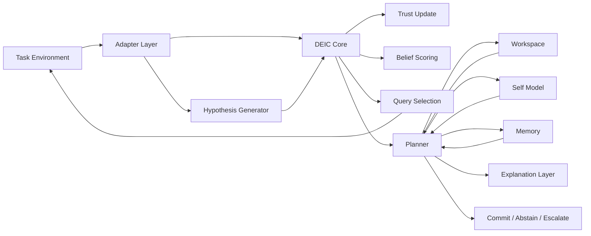
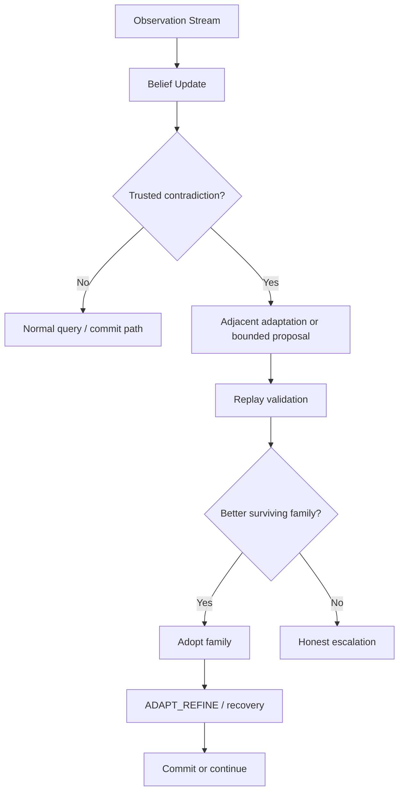
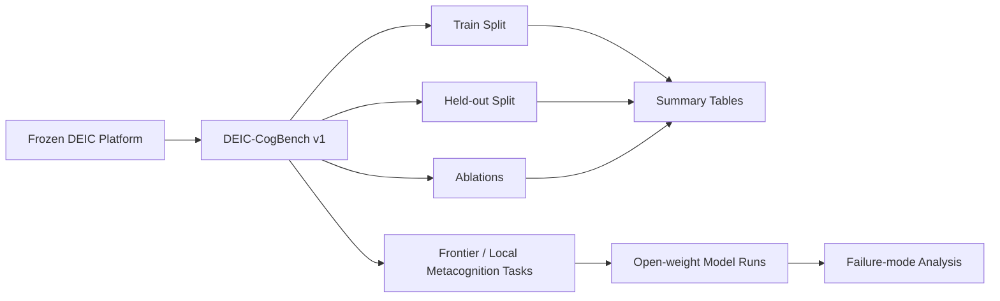

# DEIC: Discrete Executive Inference Core

[](https://siddhantdamre.github.io/Wait-a-minute...who-are-you/)
[](https://github.com/Siddhantdamre/Siddhantdamre/blob/main/PORTFOLIO.md)
[](LICENSE)

A research repository for bounded cognitive reasoning under partial observability.

This project centers on **DEIC**: a reusable executive inference subsystem that maintains discrete hidden-state beliefs, tracks source reliability, allocates diagnostic queries under budget pressure, and supports bounded adaptive recovery when the assumed structure family is wrong.

The repository contains three mature layers of work:

1. **A frozen bounded cognitive subsystem** in `deic_core/`
2. **A reusable benchmark package** in `benchmarks/exec_meta_adapt/`
3. **A metacognition benchmark path** that evaluates `COMMIT` vs `ABSTAIN` vs `ESCALATE` behavior in open-weight models

This is **not** a claim of AGI. It is a concrete, testable research program around hidden-state inference, trust, safety-aware abstention, bounded adaptation, and metacognitive evaluation.

## Recruiter Quick Look

| What to check | Why it matters |
| --- | --- |
| [Live surface](https://siddhantdamre.github.io/Wait-a-minute...who-are-you/) | Fast conceptual overview of the DEIC research direction. |
| `deic_core/` | Core bounded inference subsystem. |
| `benchmarks/exec_meta_adapt/` | Benchmark package and evaluation harness. |
| `docs/releases/` | Submission-ready notes and benchmark results. |
| `tests/` | Regression and smoke-test coverage. |
| `docs/DEMO_ROADMAP.md` | Plan for turning the repo into an interactive simulator. |

---

## What This Repository Contains

### 1. DEIC Core

The main bounded cognitive subsystem lives in `deic_core/`.

It provides:
- discrete hidden-state belief maintenance
- adaptive trust discovery
- information-gain query selection
- bounded planner-driven recovery
- workspace, self-model, memory, and explanation support

### 2. DEIC-CogBench

The packaged benchmark lives in `benchmarks/exec_meta_adapt/`.

It evaluates:
- executive function
- metacognition
- adaptive learning under partial observability
- safety-aware abstention and escalation

### 3. Frontier / Local Metacognition Benchmarking

The local/open-weight metacognition benchmark lives in:
- `benchmarks/exec_meta_adapt/frontier/`
- `benchmarks/exec_meta_adapt/frontier_local/`

It tests whether models can correctly distinguish:
- `COMMIT`: evidence is sufficient
- `ABSTAIN`: evidence is insufficient, but not structurally broken
- `ESCALATE`: contradiction, trust failure, or model insufficiency requires outside review

---

## Why This Project Matters

The most important architectural result in this repo is:

> **The reusable part of this cognition problem is the inference engine, not the domain-specific hypothesis generator.**

That result was earned by:
- solving the original Byzantine-style executive benchmark
- transferring the same core to a cyber diagnosis domain
- transferring again to a clinical deterioration domain
- preserving safety and abstention behavior while adding bounded adaptive recovery
- packaging the result into a benchmark other researchers can actually run

On top of that, the post-submission metacognition benchmark now shows something stronger than a simple safe/unsafe split:

> **The benchmark separates multiple metacognitive failure modes rather than rewarding one generic "safe" behavior.**

Specifically, the current open-model expansion distinguishes:
- **over-escalation collapse** (`qwen`, `smollm`)
- **under-escalation / over-abstention tradeoff** (`granite`)
- **parse/bluff fragility** (`tinyllama`)

---

## Architecture Overview

### DEIC System Architecture



### Bounded Adaptive Recovery Path



### Benchmark and Evaluation Flow



---

## Core Results

### Cross-Domain DEIC Result

DEIC's core inference mechanisms transferred across:
- the original Byzantine executive benchmark
- cyber incident diagnosis
- clinical deterioration monitoring

The central finding was:
- **trust handling, posterior update, and query selection transfer**
- **the main adaptation requirement is the hypothesis generator**

### Bounded Adaptive Recovery

The bounded adaptive path became operational through:
- `ADAPT_REFINE`
- final trigger closeout
- one-shot post-probe family proposal
- DSL v1 replay-validated bounded proposal

This produced a real bounded DSL result:
- protected baselines stayed intact
- silent failure remained `0`
- `gs=7` unseen overflow-style mismatch cases improved materially
- the gain remained bounded and domain-shaped rather than open-ended

### Metacognition Benchmark Result

The local/open-weight benchmark result is now:

> Small open models can avoid bluffing and silent failure while still failing metacognitively in different ways.

Current failure modes separated by the benchmark:
- `qwen` / `smollm`: over-escalation collapse
- `granite`: under-escalation / over-abstention tradeoff
- `tinyllama`: parse/bluff fragility

That means the benchmark is not merely scoring one "safe" pattern. It is distinguishing **different metacognitive safety/calibration failures**.

---

## Repository Map

| Path | Purpose |
|---|---|
| `deic_core/` | Frozen bounded cognitive subsystem |
| `benchmark/` | Legacy benchmark ladder and earlier harnesses |
| `benchmarks/exec_meta_adapt/` | DEIC-CogBench v1 packaged benchmark |
| `benchmarks/exec_meta_adapt/frontier/` | Frozen metacognition task, parser, and scorer contract |
| `benchmarks/exec_meta_adapt/frontier_local/` | No-API local/open-weight runner |
| `experiments/` | Validation harnesses, transfer runs, and archived negative results |
| `docs/milestones/` | Frozen subsystem and benchmark milestone notes |
| `docs/releases/` | Submission-ready notes, figures, and bundle docs |
| `submission/` | Frozen exported submission assets |
| `tests/` | Regression and smoke-test coverage |
| `True_AGI_Core/` | Older historical AGI-oriented prototypes and reference material |

For directory-level orientation, most first-party folders now also include their own `README.md`.

---

## Important Checkpoints

| Tag / Checkpoint | Meaning |
|---|---|
| `v1.4-deic-cogbench` | Benchmark-package checkpoint |
| `v1.5-post-probe-family-proposal` | Bounded recovery checkpoint |
| `v1.6-dsl-v1` | First mergeable bounded dynamic-structure-learning result |
| `submission-2026-04-16` | Frozen benchmark submission checkpoint |

---

## Quick Start

### Install

Use your preferred Python environment, then install the project dependencies you need for the target workflow.

For local/open-weight metacognition benchmarking:

```bash
python -m pip install transformers accelerate sentencepiece
```

### Run Core Regression Checks

```bash
python -m pytest tests/test_workspace.py tests/test_planner.py tests/test_transfer_regression.py tests/test_golden_c6.py -q
```

### Run DEIC-CogBench

```bash
python benchmarks/exec_meta_adapt/run_suite.py
```

Small smoke run:

```bash
python benchmarks/exec_meta_adapt/run_suite.py --max-tasks 2 --max-episodes 2
```

### Run Local Metacognition Benchmark

```bash
python benchmarks/exec_meta_adapt/frontier_local/run_frontier_local.py --models qwen smollm --tasks benchmarks/exec_meta_adapt/frontier/frontier_tasks_metacog.jsonl --output results/frontier_local/full_40/
```

### Run Open-Model Expansion

```bash
python benchmarks/exec_meta_adapt/frontier_local/run_frontier_local.py --models granite qwen smollm tinyllama --tasks benchmarks/exec_meta_adapt/frontier/frontier_tasks_metacog.jsonl --output results/frontier_local/open_model_expansion/full_40_single/
```

---

## Key Documents

### Benchmark and Milestone Docs
- `docs/DEIC_BENCHMARK_PACKAGE.md`
- `docs/milestones/deic_platform_v1.md`
- `benchmarks/exec_meta_adapt/README.md`

### Submission and Benchmark Result Docs
- `docs/releases/frontier_local_submission_bundle.md`
- `docs/releases/frontier_local_metacognition_first_results.md`
- `docs/releases/frontier_local_metacognition_expansion.md`
- `docs/releases/frontier_local_metacognition_expansion_abstract.md`

### Strategy / Next Phase
- `SUBMITTED_CHECKPOINT.md`
- `NEXT_PHASE_OPTIONS.md`

---

## What This Repository Is Not Claiming

This project is **not** claiming:
- AGI
- general intelligence
- consciousness
- open-ended structure invention
- broad causal or world-model competence

What it **does** claim:
- a reusable bounded executive inference subsystem
- benchmark-grade evaluation for that subsystem
- a real bounded DSL v1 result
- a metacognition benchmark that separates multiple failure modes in open models

---

## Current Status

The project is in a good, disciplined state:
- submission artifacts are frozen
- bounded DEIC milestones are tagged
- the metacognition expansion result is checkpointed
- future work is separated from frozen results

The next sensible directions are:
- benchmark expansion and external-facing reporting
- DSL v2 design-only work
- applied wrappers around the frozen DEIC core

---

## License / Usage Note

If you plan to publish or reuse this work externally, review the benchmark artifacts, submission bundle, and any generated assets carefully so the packaging matches your intended release standard.
